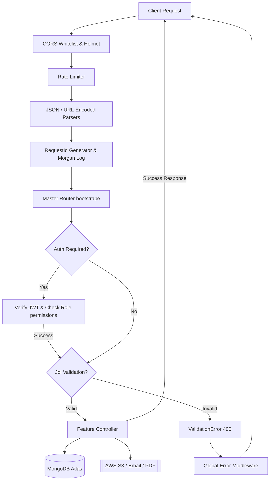

# EDUsite Backend 🎓

A robust, modular, production-ready Backend-as-a-Service (BaaS) for educational platforms. Designed using a feature-based architecture, this backend powers online learning management systems (LMS) by streamlining administrative, pedagogical, and communication workflows.

---

## ## What This Is
**EDUsite Backend** is a secure RESTful API built on the Node.js runtime using the Express.js framework and MongoDB (Mongoose ODM). It functions as a complete engine for student management, role-based course organization, assignments, automated/manual grading workflows, educational material distribution, and reporting.

Designed to be deployed as serverless functions (configured for Vercel) or run as a standalone server, the project integrates cloud storage (AWS S3), automated emailing (Nodemailer), document generators (PDFKit, ExcelJS), and robust middleware layers for security, rate-limiting, and validation.

---

## ## The Problem It Solves
Traditional educational environments and legacy software suffer from fragmented workflows and manual administration overhead. **EDUsite Backend** addresses these challenges by solving the following key problems:

1. **Scattered Resources & Media Files**: Rather than hosting files locally or on insecure drives, it leverages AWS S3 with presigned URLs. This guarantees secure, time-limited, and scalable distribution of course materials, lecture videos, and student submissions.
2. **Complex Access Management**: Different people need different permissions. Teachers require full control; students only need access to their courses; and Teaching Assistants (TAs) need restricted administrative rights. The application features a detailed role hierarchy (`main_teacher`, `assistant`, `student`) with group-specific boundary permissions.
3. **Manual Report Drafting**: Teachers waste hours assembling marks at the end of terms. The reporting module consolidates all assignment statuses (on-time, late, missing) and exam grades, generating downloadable PDF and Excel spreadsheets instantly.
4. **Disorganized Content Delivery**: Courses are broken down into logical sections and groups. The `/sections` API allows teachers to link exams, materials, and assignments together sequentially, mimicking a structured physical syllabus.
5. **Security & Request Abuse**: Public-facing backends are vulnerable to spam and DDoS attempts. Integrated rate-limiting (e.g. for login forms, contact forms, and review submissions), strict CORS whitelists, request validation via Joi, and Helmet headers ensure standard-compliant hardening.

---

## ## Stack
The application is engineered around modern, lightweight, and performant technologies:

*   **Runtime Environment**: [Node.js](https://nodejs.org/) (v22.x) using ES Modules (`import/export`).
*   **Web Framework**: [Express.js](https://expressjs.com/) for routing, middleware pipelines, and controller management.
*   **Database & ODM**: [MongoDB](https://www.mongodb.com/) with [Mongoose](https://mongoosejs.com/) for document schema definition, validation, and relationships.
*   **Storage & Cloud Integration**: [AWS SDK v3](https://aws.amazon.com/sdk-for-javascript/) (`@aws-sdk/client-s3`) & `@aws-sdk/s3-request-presigner` to handle secure cloud file operations.
*   **Security & Controls**:
    *   `bcrypt` for secure user password hashing.
    *   `jsonwebtoken` (JWT) for stateless user sessions.
    *   `helmet` for securing HTTP headers.
    *   `cors` for controlling domain origins.
    *   `express-rate-limit` to prevent credential stuffing and form spamming.
*   **Document Generation**:
    *   [PDFKit](https://pdfkit.org/) and `pdf-lib` for programmatic, custom-styled PDF reports.
    *   [ExcelJS](https://github.com/exceljs/exceljs) for generating spreadsheet summaries.
*   **Validation & Formatting**:
    *   `joi` for strict API payload and query param validation.
    *   `date-fns` and `date-fns-tz` for timezone-aware date parsing and reporting ranges.
    *   `slugify` & `nanoid` for safe string mapping and unique ID generation.
*   **Logging & Diagnostics**:
    *   `pino` for low-overhead structured logs.
    *   `morgan` for real-time HTTP request logging, configured with unique correlation IDs (`requestId`).

---

## ## Key Features
*   **Granular Authentication & Authorizations**: Custom middlewares (`isAuth`, `AdminAuth`, `canEditSection`, `canManageGroupStudents`) ensure that assistants can only manipulate students or upload files inside the groups they have been assigned to, while teachers maintain global administrative scopes.
*   **Secure Document Uploads via S3 Presigned URLs**: Students submit files and teachers upload materials without route bottlenecks, using short-lived secure URLs generated directly from the server.
*   **On-Demand Progress Summaries**: Automatic reporting calculates averages for both assignments and exams, tags assignments as "late" or "on-time" based on dates, and compiles them into professional PDFs and formatted Excel files.
*   **Group Invite and Onboarding Flow**: Main teachers can generate unique invite links containing cryptographically secure tokens. Students click the links to verify their identity and automatically join their designated classroom groups.
*   **Validation & Error Handling**: A centralized, asynchronous global error handler intercepts all runtime issues, logs them with `pino`, and responds with sanitized error payloads. All endpoint payloads are pre-validated before hitting database models.

---

## ## Architecture
The codebase uses a **Modular Feature-Based Layered Architecture**, separating logic into functional domains. This avoids a monolithic clutter, making it easy to scale teams and test features independently.

### Project Directory Structure
```text
├── api/                    # Entry point for Serverless platforms (e.g. Vercel)
│   └── index.js            # Express app instantiation, global middleware setup, and DB boot
├── DB/                     # Database layer
│   ├── DB.Connect.js       # MongoDB connection initializer using Mongoose
│   └── models/             # Mongoose schemas for data persistence
├── src/                    # Main source directory
│   ├── index.router.js     # Master router registering all modules and global handlers
│   ├── auth/               # Module handling auth (signups, password resets, emails)
│   ├── Modules/            # Core business domains (Exams, Assignments, Groups, etc.)
│   │   └── [FeatureName]/
│   │       ├── controller/ # Sub-controllers split by intent (e.g. start.js, edit.js, get.js)
│   │       ├── *.router.js     # Domain-specific Express routes
│   │       └── *.validation.js # Joi schemas for request validation
│   ├── middelwares/        # Custom Express middlewares (auth, limits, validators)
│   └── utils/              # Shared helper functions (AWS S3, email, error handling)
└── vercel.json             # Vercel configuration for serverless deployment
```

### Request Flow Pipeline
The diagrams below illustrate how incoming requests flow through security, authentication, validation, and feature modules:



---

## ## API Modules
The system is partitioned into the following functional API namespaces, each mapped in the master router:

### 🔑 Authentication & Profiles (`/student`)
Manages registration, email confirmations, credentials authentication, and password updates.
*   `POST /signup` - Registers new students.
*   `GET /confirmEmail/:email` - Validates student accounts via email link.
*   `GET /newConfirmEmail/:email` - Requests a new validation link.
*   `POST /login` - Student login (Rate-limited).
*   `POST /teacher/login` - Administrator and TA login (Rate-limited).
*   `POST /forget` / `POST /reset/:token` - Standard password recovery flow.
*   `GET /profile` - Fetches authenticated user info.
*   `GET /unassigned` - Lists students not assigned to any group, filtered by grade.

### 👥 Classroom Groups (`/group`)
Structures student groupings, classroom boundaries, and manages registration links.
*   `POST /create` - Creates a new group (*Main Teacher only*).
*   `PATCH /archive` - Archives or restores a group (*Main Teacher only*).
*   `PUT /addstudent` - Manages manual additions of students (*Teacher/Authorized Assistant*).
*   `DELETE /removestudent` - Removes students from a class group (*Teacher/Authorized Assistant*).
*   `GET /all` / `GET /id` - Lists all groups or fetches details by ID.
*   `POST /invite/create` - Generates invite tokens for students to join.
*   `POST /join/:inviteToken` - Allows students to self-enroll into groups.

### 📚 Course Definitions (`/courses`)
Maintains the high-level course registry.
*   `GET /all` - Retrieves all courses (*Admin only*).
*   `POST /create` - Instantiates new courses (Rate-limited).
*   `DELETE /` - Removes specified courses (*Admin only*).

### 📖 Sections (`/sections`)
Represents course chapters or physical syllabus units, linking assignments, exams, and materials.
*   `GET /` - Fetches all sections.
*   `POST /create` - Creates a section.
*   `PUT /:sectionId/update-links` - Links/unlinks files, exams, or tasks to a section (*Teacher/Authorized Assistant*).
*   `GET /:sectionId` - Aggregates and returns the specific metadata and resources within a section.
*   `DELETE /:sectionId` - Removes a section.

### 📝 Exams (`/exams`)
Manages academic exam creation, scheduling, student submissions, and grading.
*   `POST /` - Creates exams.
*   `POST /submit` - Allows students to send exam answers.
*   `GET /` - Lists exams.
*   `PATCH /grade` - Scores and returns feedback to students.

### 📂 Assignments (`/assignments`)
Supports homework tasks, cloud upload targets, and submission tracking.
*   `POST /create` - Publishes new assignments.
*   `GET /` / `GET /id` - Retrieves assigned student work.
*   `POST /submit` - Registers student submissions (linked to uploaded cloud documents).

### 📁 Materials (`/material`)
Enables uploading course documents, PDF slides, and videos.
*   `POST /create` - Associates course materials with a group.
*   `POST /generate-upload-url` - Generates a secure AWS S3 presigned URL for direct client file uploads.
*   `GET /` / `GET /:materialId` - File viewing with access rules enforcement.
*   `DELETE /:materialId` - Deletes materials from DB and S3 (*Admin only*).

### 📊 Performance Reports (`/reports`)
Compiles data into downloadable files.
*   `GET /reports` / `POST /reports` - Builds on-the-fly student performance reports for a specified time frame. Emits formatted **PDF reports** (PDFKit) or **Excel sheets** (ExcelJS) containing metrics on averages, late assignments, and missing works.

### 💬 Contact & Feedback (`/contact` & `/reviews`)
Maintains parent/public contact channels and landing page review metrics.
*   `POST /contact` - Public inquiry submission form (Rate-limited).
*   `GET /contact` - Lists submitted inquiry messages (*Teacher/Assistant only*).
*   `PATCH /contact/:contactId/status` - Updates query status (*Teacher/Assistant only*).
*   `POST /reviews` - Students submit reviews of the courses.
*   `GET /reviews` - Public route retrieving approved reviews for landing pages.
*   `PATCH /reviews/:reviewId/status` - Approves or hides student reviews (*Admin only*).

### 🔍 Utility Tools (`/search` & `/health`)
*   `GET /search/content` - Quick search across assignments, exams, and materials for linkage setup (*Admin/Teacher only*).
*   `GET /health` - Diagnostic route exposing API uptime and request correlation tracking.

---
